# LiquidEkycServiceImpl 各函数 PlantUML 流程图

指挥官，初月把 `LiquidEkycServiceImpl` 里的每一个方法都拆成了 PlantUML 活动图，一共 20 个。逻辑分支、try/catch、异步 fork/join 都对照原始代码逐条还原，没有偷懒省略～ 复制到支持 PlantUML 的工具里即可渲染。

---

## 1. getToken(GetTokenRequestDTO)

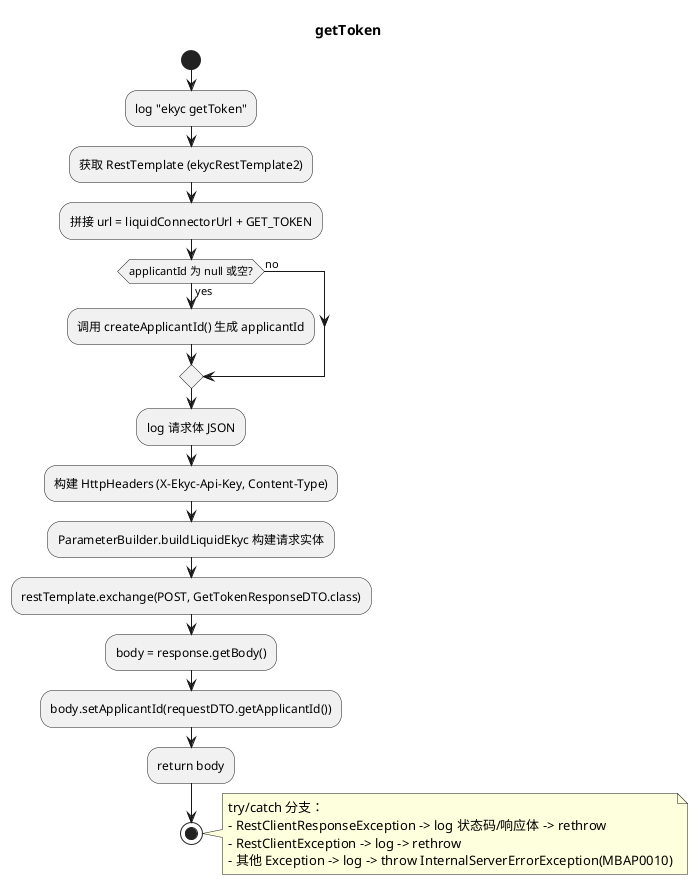

---

## 2. requestInformation(EkycRequestInformationRequestDto) [private]

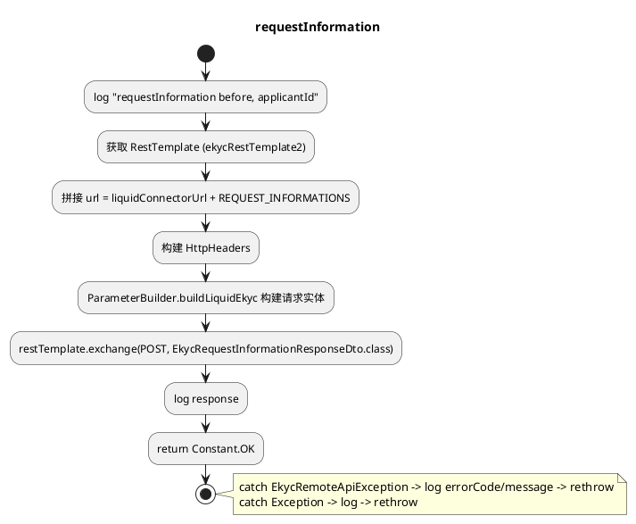

---

## 3. getPhotos(String applicantId) [private]

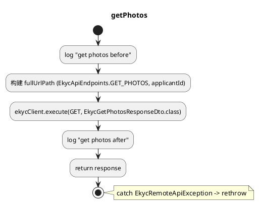

---

## 4. getVerificationResult(String applicantId) [private]

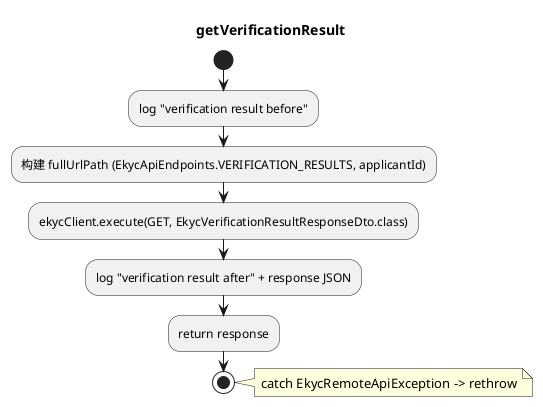

---

## 5. getIdDocumentInformation(String applicantId) [private]

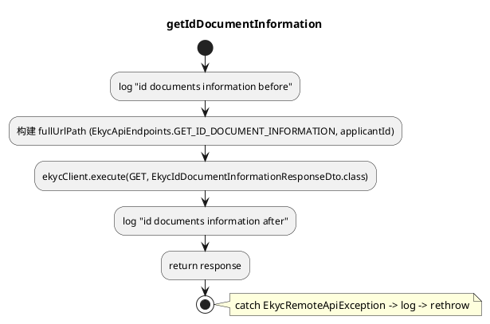

---

## 6. getKycResult(EkycKycResultRequestDto) [private]

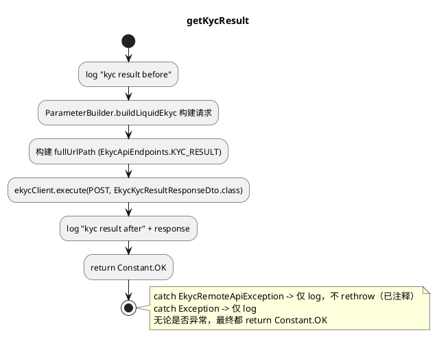

---

## 7. createApplicantId() [private]

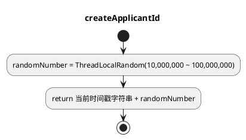

---

## 8. setFinishVerificationWithJpki(EkycFinishVerificationRequestDto)

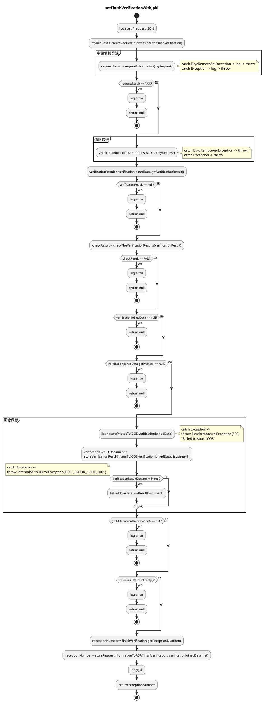

---

## 9. setFinishVerificationWithHe(EkycFinishVerificationRequestDto)

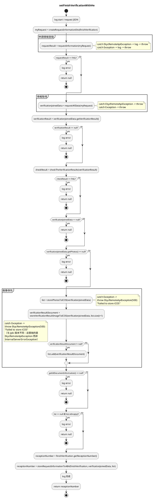

---

## 10. checkTheVerificationResults(EkycVerificationResultResponseDto) [private]

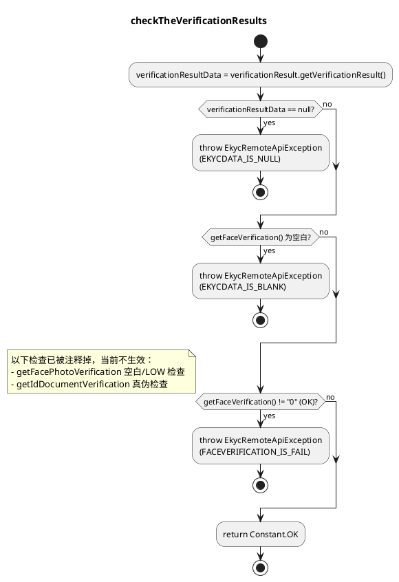

---

## 11. createRequestInformationDto(EkycFinishVerificationRequestDto) [private]

```plantuml
@startuml
title createRequestInformationDto
start
:从 finishVerification 提取
姓名/生年月日/性别/住所/
电话/身份证号等字段;

if (applicantId 为空白?) then (yes)
  :log "applicantId is null";
else (no)
endif
:requestDto.setApplicantId(applicantId);

if (lastName 为空白?) then (yes)
  :log "lastName is null";
else (no)
endif
:requestDto.setLastName(lastName);

:requestDto.setFirstName(firstName);
:requestDto.setMiddleName / KanaName フィールド設定;

if (birthday 为空白?) then (yes)
  :log "birthday is null";
else (no)
endif
:requestDto.setBirthday(birthday.replace("-",""));

if (zipCode 为空白?) then (yes)
  :log "zipCode is null";
else (no)
endif
:requestDto.setZipCode(zipCode);

if (sex 为空白?) then (yes)
  :log "sex is null";
else (no)
endif
:requestDto.setSex(sex);

:requestDto.setNationality("jp") 固定值;
:设置 phoneNumber / address1~4 / idNumber;
:return requestDto;
stop

note right
注意：仅打印 log 提示字段为空，
并未阻断流程（无异常抛出）。
若 birthday 为 null 会在
.replace("-","") 处 NPE。
end note
@enduml
```

---

## 12. getTheKycResult(...) [private]

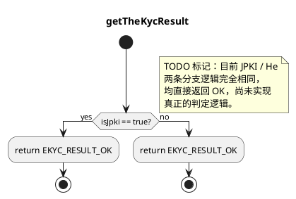

---

## 13. requestAllData(EkycRequestInformationRequestDto) [private]

```plantuml
@startuml
title requestAllData（异步并发获取三类数据）
start

fork
  :CompletableFuture:
  photosFuture = getPhotos(applicantId);
fork again
  :CompletableFuture:
  verificationResultFuture ->
  result = getVerificationResult(applicantId);
  if (result.facePhotoVerification == null?) then (yes)
    :sleep 9 秒;
    :result = getVerificationResult(applicantId) 重试;
    if (仍然为 null?) then (yes)
      :throw RuntimeException;
    else (no)
    endif
  else (no)
  endif
  :return result;
fork again
  :CompletableFuture:
  idDocumentInformationFuture =
  getIdDocumentInformation(applicantId);
end fork

:CompletableFuture.allOf(三者).join();

if (三者均成功?) then (yes)
  :分别 get() 三个结果;
  :构建并 return
  EkycVerificationJoinedData
  (requestDto, photos, verificationResult, idDocumentsInformation);
  stop
else (no)
  :构建通用异常 exception
  (INTERNAL_SERVER_ERROR,
  "リクエスト読取失敗");
  if (photosFuture 异常完成?) then (yes)
    :getOriginalException(photosFuture);
    if (是 EkycRemoteApiException?) then (yes)
      :throw 该异常;
    else (no)
      :throw exception;
    endif
    stop
  else (no)
  endif
  if (verificationResultFuture 异常完成?) then (yes)
    :getOriginalException(verificationResultFuture);
    if (是 EkycRemoteApiException?) then (yes)
      :throw 该异常;
    else (no)
      :throw exception;
    endif
    stop
  else (no)
  endif
  if (idDocumentInformationFuture 异常完成?) then (yes)
    :getOriginalException(idDocumentInformationFuture);
    if (是 EkycRemoteApiException?) then (yes)
      :throw 该异常;
    else (no)
      :throw exception;
    endif
    stop
  else (no)
  endif
  :throw exception (兜底);
  stop
endif
@enduml
```

---

## 14. getOriginalException(CompletableFuture<?>) [private]

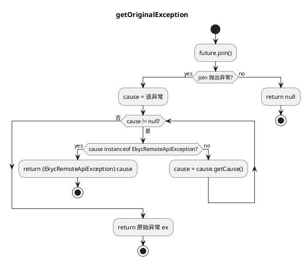

---

## 15. storePhotosToICOS(EkycVerificationJoinedData) [private]

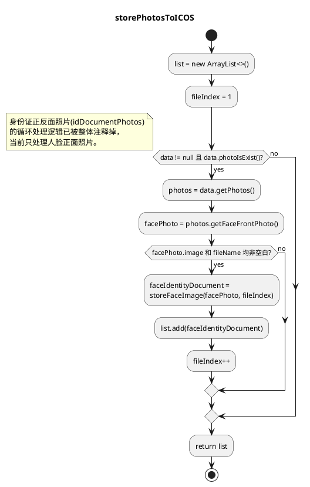

---

## 16. storeVerificationResultImageToICOS(EkycVerificationJoinedData, int) [private]

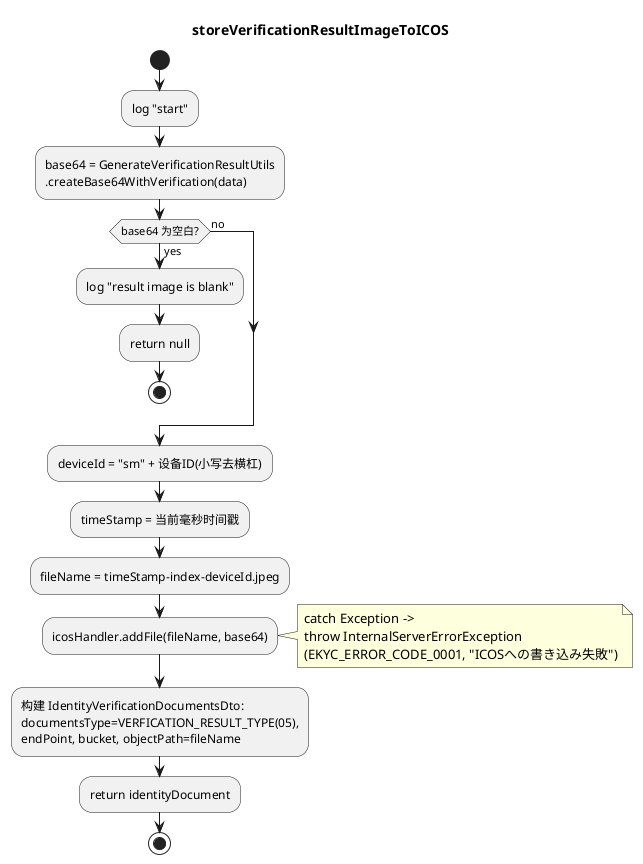

---

## 17. storeFaceImage(EkycCommonPhotoDto, int) [private]

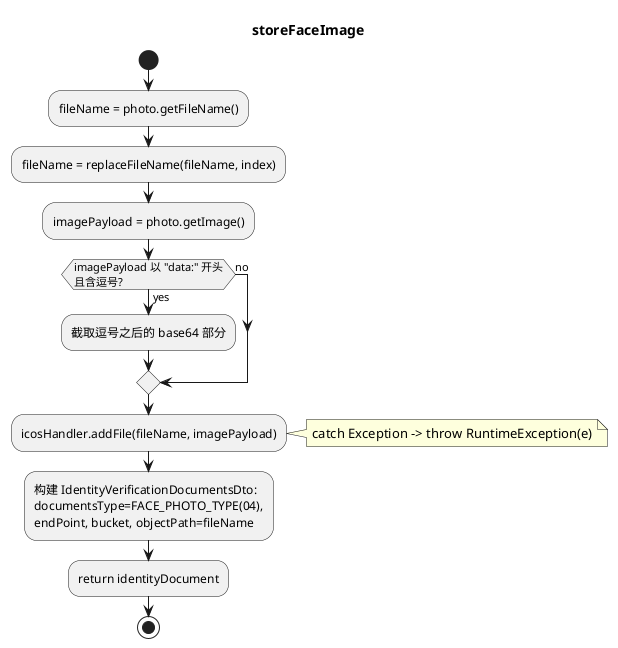

---

## 18. storeDocumentsPhotos(EkycPhotosInformationDto, int) [private]

```plantuml
@startuml
title storeDocumentsPhotos
start
:fileName = documentsPhoto.getFileName();
:fileName = replaceFileName(fileName, index);

:icosHandler.addFile(fileName, documentsPhoto.getImage());
note right: catch Exception -> throw RuntimeException(e)

:documentType = documentsPhoto.getPhotoType();
(01:表面 / 02:裏面 / 03:斜め);
:构建 IdentityVerificationDocumentsDto:
documentsType=documentType,
endPoint, bucket, objectPath=fileName;
:return identityDocument;
stop

note right
当前该方法未被业务流程调用
（storePhotosToICOS 中对应的
循环调用已被注释掉）。
end note
@enduml
```

---

## 19. storeRequestInformationToABA(...) [private]

```plantuml
@startuml
title storeRequestInformationToABA
start

if (data == null 或
!data.idDocumentInformationIsExist()?) then (yes)
  :return null;
  stop
else (no)
endif

:idDocumentInformation = data.getIdDocumentInformation();
:receptionNumber = finishVerification.getReceptionNumber();
:personType / updateType / screenId 取得;
:ekycIdDocumentType 转换为
bffIdDocumentType
(EkycIdDocumentTypeCode.convert...);

if (personType == INDIVIDUAL?) then (个人)
  :解析姓名 NameParser.parseJapaneseName;
  :构建 AccountOpenAppliContentRegistration
  IndividualAbaRequestDto;
  :设置 氏名/生年月日/郵便番号/画面ID/
  ekycResult=CHECKED/身份证明文件列表/
  文件代码/申込ステータス=開始;
  :accountOpeningLogic
  .accountOpenAppliIndividualContentRegistration(...);
  :receptionNumber = 响应.getReceiptNumber();
elseif (personType == CORPORATE?) then (法人)
  :构建 AccountOpenAppliContentUpdate
  CorporationAbaRequestDto;
  :设置 receiptNumber;
  if (updateType == "013" 代表者本人?) then (yes)
    :setCeoIdentityDocuments(list);
  elseif (updateType == "017" 事業先?) then (yes)
    :setBusinessDocuments(list);
  else (其他)
  endif
  :设置 画面ID/ekycResult=CHECKED/updateType;
  :accountOpeningLogic
  .accountOpenAppliContentCorporationUpdate(...);
elseif (personType == ONE_PERSON_OPERATION_PERSON?) then (个体经营)
  :构建 AccountOpenAppliContentUpdate
  SelfempAbaRequestDto;
  :设置 receiptNumber/ekycResult=CHECKED/
  ceoIdentityDocuments/画面ID/updateType;
  :accountOpeningLogic
  .accountOpenAppliContentSelfempUpdate(...);
elseif (personType 为空字符串?) then (CC发行场景)
  :构建 CcIssuingApplicationContent
  RegistrationAbaRequestDto;
  :设置 画面ID/申込ステータス=開始/
  cashCardType="0"/身份证明文件列表/
  ekycResult=CHECKED;
  :cashcardIssueLogic
  .contractMmanagementOperationHistoryRegistration(...);
  :receptionNumber = 响应.getReceiptNumber();
else (未匹配任何分支)
  :不做任何处理;
endif

:return receptionNumber;
stop
@enduml
```

---

## 20. replaceFileName(String, int) [private]

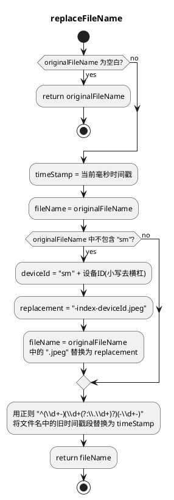

---

### 补充说明（初月的小提醒）

几处流程里藏着一些值得指挥官注意的地方：

- `setFinishVerificationWithJpki` 与 `setFinishVerificationWithHe` 几乎是完全重复的代码（唯二差异在 `storeVerificationResultImageToICOS` 失败时抛出的异常类型不同：一个是 `InternalServerErrorException`，一个是 `EkycRemoteApiException`），可以考虑抽成公共私有方法，减少维护成本。
- `getKycResult` 的异常被吞掉（catch 后仅 log，不 rethrow），无论成功失败都返回 `Constant.OK`，调用方无法感知真实结果。
- `getTheKycResult` 目前是纯 TODO 占位，JPKI/He 两条分支都直接返回 OK。
- `createRequestInformationDto` 对空字段只打日志，不做任何拦截，`birthday` 为 `null` 时会在 `.replace("-","")` 处抛 NPE。
- `storeDocumentsPhotos` 与身份证照片循环逻辑均被注释掉，当前未被实际调用，方法处于"死代码"状态。
- `checkTheVerificationResults` 中的相片比对、证件真伪校验目前都被注释掉，只剩下人脸真伪校验生效。

如果需要初月把这些问题点也单独整理成一份技术债清单，或者把图导出成 PDF/图片，跟初月说一声就好～♪
